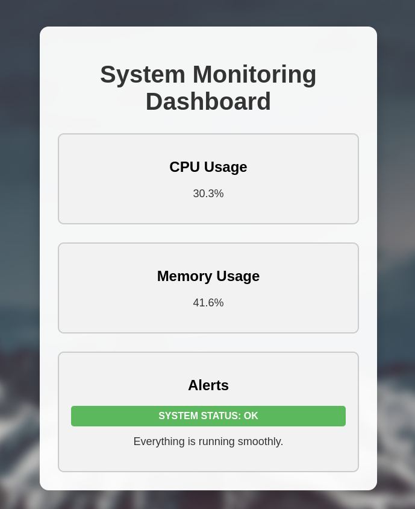

<!-- ABOUT THE PROJECT -->
## About The Project

The System Monitoring tool is a Python-based application that allows users to monitor their system's CPU and memory usage in real-time.

### Key features of this project:
* Real-time Monitoring: The script uses the 'psutil' library to fetch real time CPU and Memory usage information. When a user enter the application through the web browser, the tool instantly provides the current CPU and Memory usage percentages.
* Warning System: The script checks if the CPU usage or Memory usages gets over 80% and issues a warning message.
* Web Interface via Flask: The python script uses the Flask web framework to create a simple web application.


### Built With
The project is built with Python, HTML, and Flask.

[![Python][Python]][Python-url] [![HTML5][HTML5]][HTML5-url] [![Flask][Flask]][Flask-url]

<!-- TO-DO Section -->
### To Do:
* Add historical CPU and memory usage data over different time periods.
* Improve the HTML/CSS of the monitoring dashboard for a more user-friendly and visually appealing interface.
* Set up Docker for the application to enable easy deployment and management.


<!-- Getting Started Section -->
## Getting Started
To get started with the system monitoring, follow the steps below:

<!-- Requirements Section -->
### Requirements

- Python 
- Flask
- psutil
<!-- Installation Section -->
### Installation

1. Clone the repository:

   ```bash
   git clone https://github.com/sbendarsky/Python-System-Monitor.git
   cd Python-System-Monitor
    ```

2. Install the required dependencies:

   ```bash
   pip install -r requirements.txt
    ```

### Usage

1. Run the application:
   ```bash
   python3 app.py
    ```

2. Open your web browser and navigate to http://localhost:5000/ to access the monitoring dashboard.
3. Monitor your system's CPU and memory usage in real-time and view historical data for analysis.

### Output


<!-- MARKDOWN LINKS & IMAGES -->
[Python]: https://img.shields.io/badge/Python-3C873A?style=for-the-badge&labelColor=black&logo=python&logoColor=3C873A
[Python-url]: https://www.python.org
[HTML5]: https://img.shields.io/badge/html5-%23E34F26.svg?style=for-the-badge&logo=html5&logoColor=white
[HTML5-url]: https://github.com/sbendarsky
[Flask]: https://img.shields.io/badge/flask-%23000.svg?style=for-the-badge&logo=flask&logoColor=white
[Flask-url]: https://flask.palletsprojects.com/en/2.3.x/


